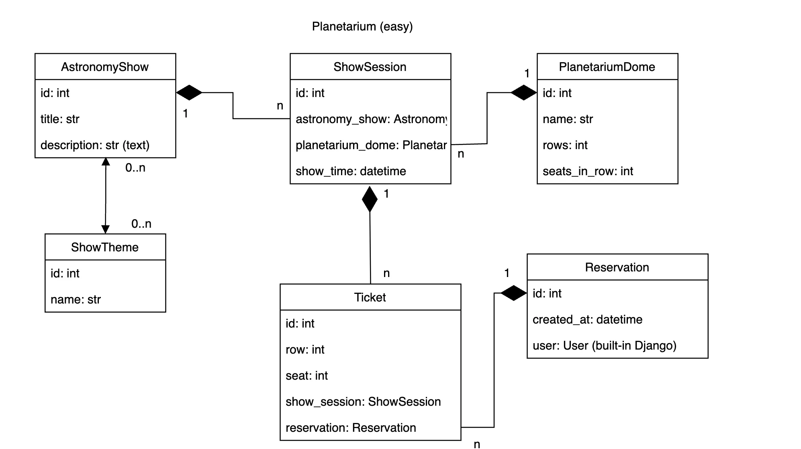
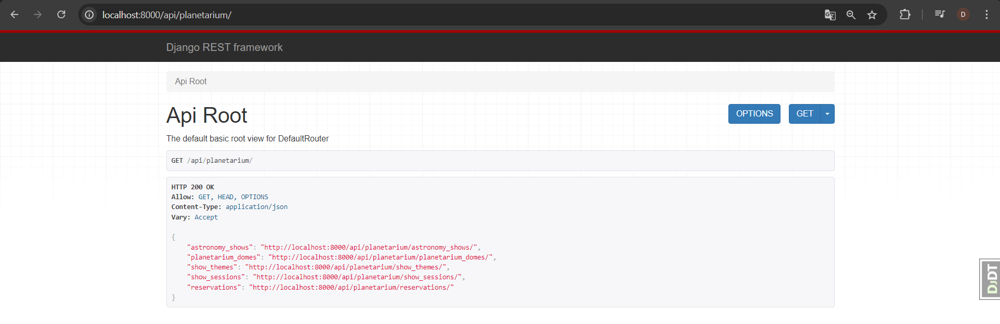

# Planetarium-API-Service
DRF project for managing planetarium

## DB Structure



## Installing

```bash
git clone https://github.com/daikj88/Planetarium-API-Service
cd planetariun
python -m venv venv
source venv/bin/activate (for MacOS)
venv\Scripts\activate (for Windows)
pip install -r requirements.txt
```
### Create .env file using .env.sample like example

## Run with docker

Docker should be installed

```bash
   docker-compose build
   docker-compose up
```

## Getting Access

- Create user via `/api/user/register/`
- Access token via `/api/user/token/`

## Features
- JWT authenticated
- Admin panel /admin/
- Documentation is located at `/api/doc/swagger/`
- Managing reservation and tickets
- Filtering astronomy shows and show sessions
- Create, changes and remove:
  * show themes;
  * astronomy shows with different show themes;
  * planetarium domes;
  * show sessions;



